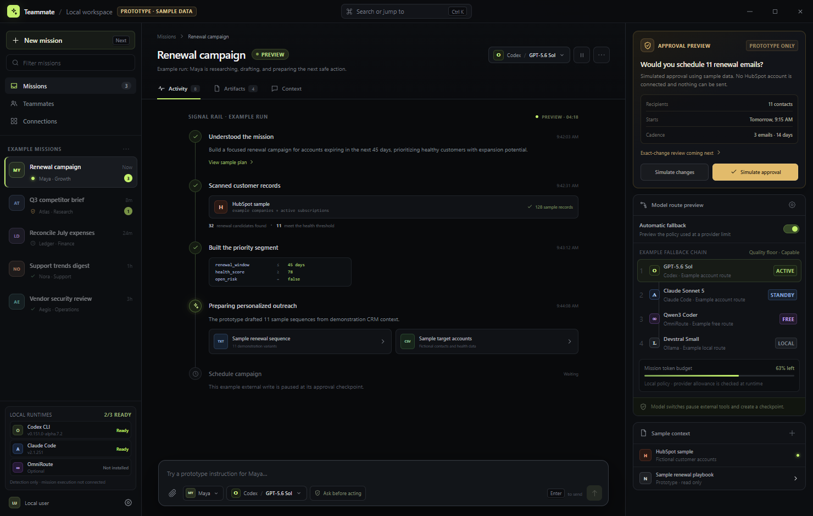

# AI Teammate Platform

A local-first, open-source platform for autonomous AI teammates with explicit model control, durable mission state, safe approvals, and transparent fallback across Codex, Claude, free-tier APIs, and local models.

The working product name is intentionally generic until naming is settled.



The screenshot uses sample mission data; the local runtime readiness panel is live.

## Why this exists

Current autonomous-agent products often hide the runtime, model, provider, permissions, and failure state behind one opaque “agent.” This project separates them and makes every important decision inspectable.

```text
Mission control plane
├─ Codex runtime → user-owned Codex account or API route
├─ Claude runtime → user-owned Claude/API route
└─ Native runtime → curated OmniRoute, direct API, or local model
```

## Repository map

- `apps/desktop` — Electron + React desktop control room.
- `packages/contracts` — shared runtime, routing, checkpoint, and event contracts.
- `packages/runtime-core` — provider-neutral routing and safe-handoff logic.
- `packages/runtime-adapters` — safe installed-CLI discovery and launch specifications.
- `docs` — product, architecture, model-routing, and cross-task context.

## What works now

The repository contains a runnable Electron/React control-room prototype. Its interactive UI includes mission filtering, the Signal Rail execution timeline, an approval receipt, command dock, runtime/model picker, and visible fallback chain. It now performs real, read-only discovery of installed Codex CLI, Claude Code, and optional OmniRoute, displaying version and authentication readiness without reading credential files.

Shared packages define the runtime/routing contracts, implement capability-aware fallback and the safe-handoff state machine, and generate conservative non-interactive Codex/Claude command specifications. Probe and mission-process transports are shell-free, prompt-on-stdin, time/output-bounded, cancellation-aware, and covered entirely by fake-runner tests.

The current mission data and activity are demonstrations. Runtime discovery is live, but Codex/Claude mission execution, durable mission storage, and real app tools are the next implementation layer; the UI does not yet perform autonomous work.

## Run locally

Requirements: Node.js 22.22+ and pnpm 11.

```powershell
cd C:\Users\<home>\Documents\Codex\ai-teammate-platform
pnpm install
pnpm dev
```

`pnpm dev` starts the Electron application with the React renderer in development mode. The install script downloads the Electron runtime when needed.

Run all checks:

```powershell
pnpm check
```

This builds every workspace package, runs TypeScript checks, and runs the test suite. The baseline was last verified on 2026-08-31 with all checks passing and 27 tests passing.

## Working from another Codex task

The canonical workspace is:

```text
C:\Users\<home>\Documents\Codex\ai-teammate-platform
```

Open that folder as a saved Codex project, then read `AGENTS.md`, `PROJECT.md`, and `docs/CROSS_TASK_CONTEXT.md`. The cross-task document contains the current handoff, safe parallel-work guidance, and a paste-ready prompt for a new task.

## Current scope

The first release runs on the user’s own computer. It will detect installed Codex and Claude CLIs, support API-key and local-model routes, and offer an optional curated OmniRoute integration. Persistent cloud computers come after the local execution, approval, and recovery model is proven.
