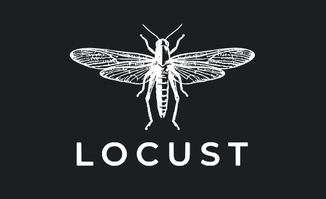
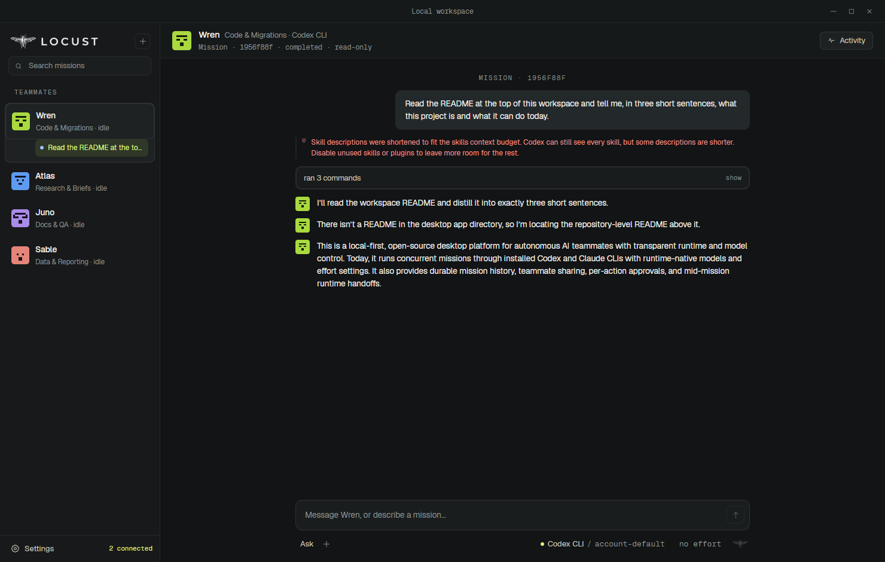

<p align="center">
  
</p>

<p align="center">
  A local-first desktop app that runs AI coding agents as a team you can watch,
  on runtimes and models you choose, with a durable record of everything they did.
</p>

---

**Locust** puts Claude, Codex, Cursor, Gemini  and many more models side by side under one roof. You give
a teammate a mission; it runs on your machine, under your own provider
accounts, in a read-only sandbox unless you say otherwise. Every event is
written to an append-only local ledger before it reaches the screen, so what
you are shown is what was recorded, and a mission survives a restart.



A real read-only Codex mission in the built app: four teammates in the roster,
Wren's mission filed under Wren, and the thread as it was recorded. Captured by
`_tools/capture-shell.mjs`, which runs the mission rather than mocking it.

## Why this exists

Most agent products hide the runtime, the model, the provider, the permissions
and the failure state behind one opaque "agent". Locust separates them and
makes every one of those decisions inspectable -- and, where it matters,
yours to make.

```text
Mission control plane
├─ Codex runtime → user-owned Codex account or API route
├─ Claude runtime → user-owned Claude/API route
└─ Native runtime → curated OmniRoute, direct API, or local model
```

## Repository map

- `apps/desktop` — Electron + React desktop control room.
- `packages/contracts` — shared runtime, routing, checkpoint, and event contracts.
- `packages/runtime-core` — provider-neutral routing and safe-handoff logic.
- `packages/runtime-adapters` — safe installed-CLI discovery, launch/process transport, and provider event normalization.
- `docs` — product, architecture, model-routing, Codex wire contract, and cross-task context.

## What works now

Everything in this section is running in the built app and verified by a live
smoke against the real CLIs, not by tests alone. The smokes live in `_smoke/`
and are run by hand: they need a signed-in provider and a desktop session, so
they are not part of `pnpm check`.

**Runtimes, side by side.** Codex CLI and Claude Code are both selectable
and both own real missions end to end. Discovery is read-only and reports
version and authentication readiness without reading credential files; a
runtime that is not ready is never drawn as available.

**Cursor Agent, as a third runtime.** Found, versioned and asked about
sign-in like the other two, with its models read off `cursor-agent
--list-models` (Grok, Composer, Gemini Flash and the Claude and GPT lines,
effort baked into each id). A mission under it runs read-only in Cursor's
plan mode or in write mode without forced commands, streams into the same
thread, resumes its own session on a reply, and is recorded as Cursor's by
a normalizer built from streams measured off the real CLI. Live-verified by
`_smoke/cursor-smoke.mjs`.

**Gemini CLI, found but refused.** Discovered and signed into, then refused
by Google: since June 2026 the CLI serves only API keys and enterprise
licences, not consumer accounts, and the app says so rather than starting a
process it cannot read. Gemini models are reachable through Cursor.

**Each runtime's own models, and effort that is actually sent.** Codex's
models come from a live `model/list`; Claude Code's from the aliases its own
`--help` advertises. Nothing is offered that the installed CLI did not name,
so a new release appears without a code change. The chosen reasoning effort
reaches the runtime (`--effort` for Claude, a config override for `codex
exec`, per-turn on the app-server transport), and a model is never offered
under a runtime it does not belong to.

**Teammates, and missions that run at once.** A teammate is local identity
and routing defaults: a name, a role, a hue and a generated pixel face seeded
from its immutable id. Missions are started by messaging a teammate; up to
four run at once, one per teammate, each with its own process and ledger
writer. A face animates only while its teammate is actually working, which
makes motion a status signal rather than decoration.

**The workroom.** Teammates share findings with each other through a
product-owned, append-only channel: a completed run ends with one share block
per named recipient, the host checks the name against the roster and posts the
message attributed to the sending mission, and the recipient's next mission is
shown it quoted as a claim -- dated, attributed, and stated to carry no
authority. Cross-references live in each mission's ledger by message id; the
text has exactly one home.

**Missions are durable.** A versioned, append-only local ledger
(`packages/mission-store`) persists mission metadata, every normalized event,
host failures, reconciled checkpoints and workroom cross-references before the
UI shows them, and restores completed, failed, cancelled and interrupted runs
after a restart with truthful integrity reporting.

**Mid-mission route switching.** A running mission can be handed to the other
runtime. The host stops it, waits for it to settle, writes a reconciled
checkpoint and briefs a continuation -- and because a mission records ONE
runtime, the continuation is a new mission that records what it continues,
which is also what actually happened. The thread shows the seam, including how
many actions were left in doubt.

**Per-action approvals.** The `approve-each` mode runs on the experimental
`codex app-server` transport, where the runtime stops before a consequential
action and the card says exactly what would happen. `Approve once` and
`Always allow` are session-scoped; there is deliberately no forever-grant.

The renderer holds no permissions and, in packaged builds, no network egress.
Automatic fallback, the curated OmniRoute gateway, app connections and
external tools remain future work -- `docs/ROADMAP.md` and
`docs/REMAINING-PLAN.md` lay out the path, and `docs/REMAINING-PLAN.md` is
also the honest list of what is still open.

## Run locally

Requirements: Node.js 22.22+ and pnpm 11.

```powershell
cd C:\Users\<home>\Documents\Codex\ai-teammate-platform
pnpm install
pnpm dev
```

`pnpm dev` starts the Electron application with the React renderer in development mode. The install script downloads the Electron runtime when needed.

Run all checks:

```powershell
pnpm check
```

This builds every workspace package, runs TypeScript checks, and runs the complete test suite: 449 tests as of 2026-09-02.

Green tests are not the evidence here. Each package carries a mutation
control (`test/mutation-control.mjs`) that breaks one behaviour at a time and
requires the NAMED test to fail, rejecting any mutation that stops the file
running -- a red suite caused by a broken file proves nothing about any test
in it. 133 mutations, all caught. Run them with `node test/mutation-control.mjs`
from a package directory.

## Working on it from another agent session

Read `AGENTS.md`, `PROJECT.md`, and `docs/CROSS_TASK_CONTEXT.md`. The
cross-task document carries the current handoff and a paste-ready prompt;
`docs/REMAINING-PLAN.md` is the ordered list of what is done and what is
open, and is kept honest about the difference.

## Current scope

The first release runs on the user’s own computer. It will detect installed Codex and Claude CLIs, support API-key and local-model routes, and offer an optional curated OmniRoute integration. Persistent cloud computers come after the local execution, approval, and recovery model is proven.
