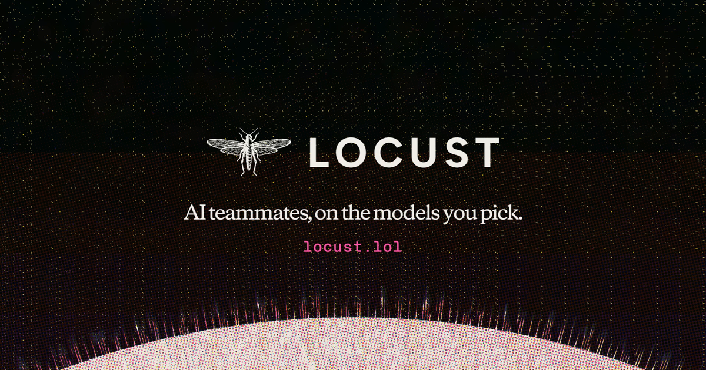
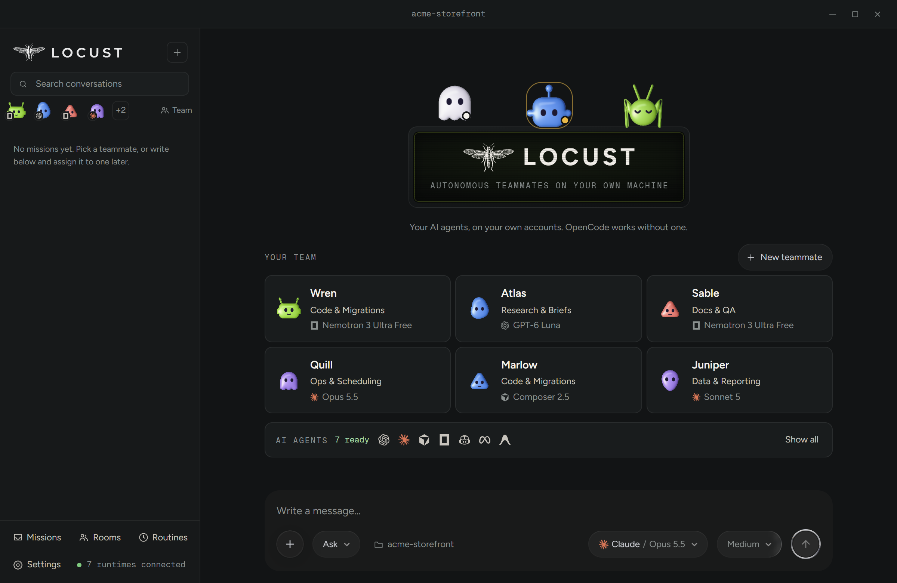
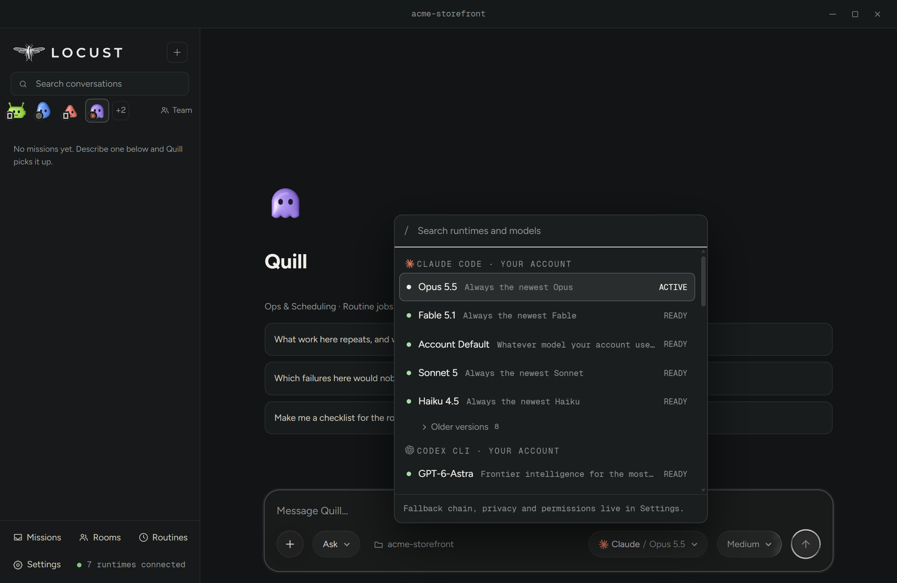
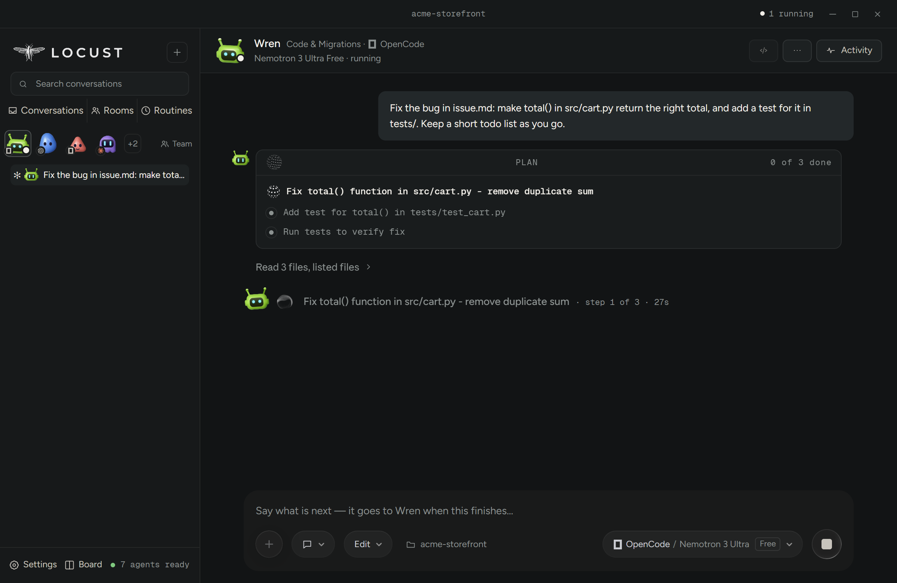
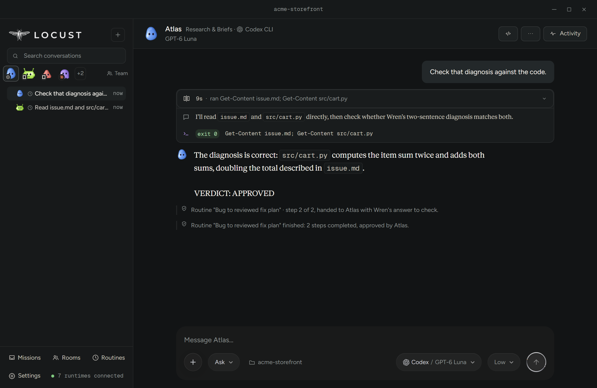
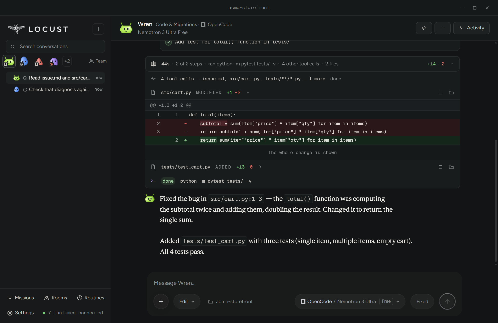
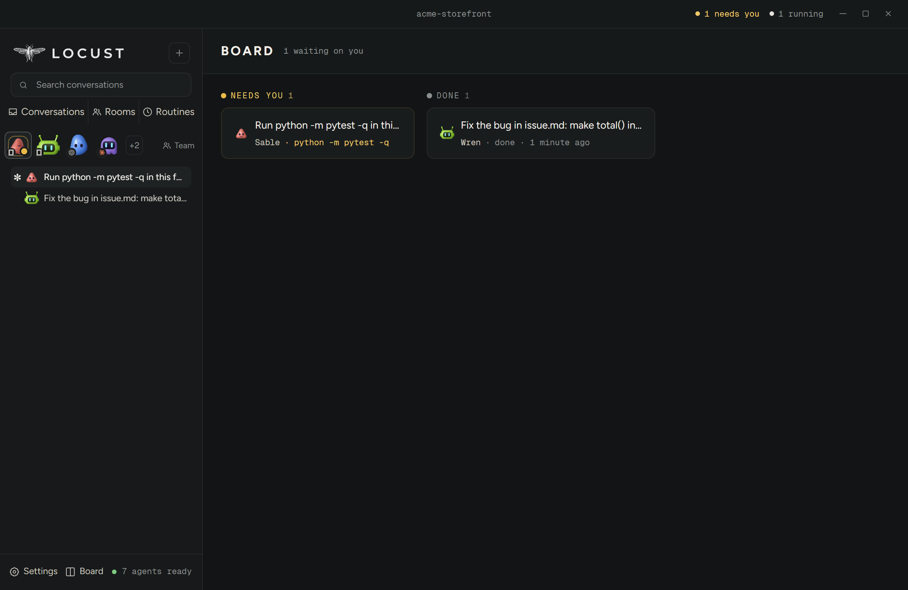

# Locust

<p align="center"><a href="https://locust.lol"></a></p>

A local-first desktop app that runs AI coding agents as a team you can watch,
on runtimes and models you choose, with a durable record of everything they did.
(Not the Python load-testing tool of the same name, which is unrelated.)

**Download the latest build** at [locust.lol](https://locust.lol) or from the
[releases page](https://github.com/automatedworkflowllc-design/locust-releases/releases/latest)
(Windows and Mac). The installer is not code-signed yet, so Windows warns that
it comes from an unknown publisher: choose **More info**, then **Run anyway**
([why, and the signing policy](docs/CODE-SIGNING.md)).

Locust is developed in this repository, and each release is cut from `main`.
Issues are welcome here; code changes are by invitation (see CONTRIBUTING.md).

**Locust** puts Claude Code, Codex, Cursor, OpenCode, GitHub Copilot,
Antigravity and Muse Code side by side under one roof. You give a teammate a
mission; it runs on your machine, under your own provider accounts, in a
read-only sandbox unless you say otherwise. Every event is written to an
append-only local ledger before it reaches the screen, so what you are shown
is what was recorded, and a mission survives a restart.

<table>
<tr>
<td><br><sub>Your team of six, each teammate on its own AI and model. Connected accounts: 7 ready.</sub></td>
<td><br><sub>One picker for the models your own accounts offer, grouped by agent, with the one in use marked.</sub></td>
</tr>
<tr>
<td><br><sub>A run in progress: a three-step plan, step 1 under way, the live line naming the step and its time.</sub></td>
<td><br><sub>Approve each: before a command runs you see the exact command, where it runs, and what Locust can and cannot tell about it.</sub></td>
</tr>
<tr>
<td><br><sub>A hand-off chain: Wren (OpenCode) diagnosed the bug; Atlas (Codex) read the code himself and wrote VERDICT: APPROVED.</sub></td>
<td><br><sub>The finished fix: 2 files edited, a test added, four tests passing, in 1m 01s.</sub></td>
</tr>
<tr>
<td><br><sub>Blind compare: two models on the same ask, names hidden until you keep one. A judge model can be asked which it would keep.</sub></td>
<td><br><sub>The Board: every conversation by what it needs from you.</sub></td>
</tr>
</table>

<sub>Screenshots from the packaged app on a fresh demo profile (0.619.0): real runs, no mocks, taken by `_tools/drive-promo-shots.mjs`. The models shown are what that machine’s accounts offer; yours come from your own accounts.</sub>

## Why this exists

Most agent products hide the runtime, the model, the provider, the permissions
and the failure state behind one opaque "agent". Locust separates them and
makes every one of those decisions inspectable -- and, where it matters,
yours to make.

```text
You ──► a teammate (name, role, face; its own runtime, model and mode)
          │
          ├─ Claude Code ──── the CLI you installed and signed into
          ├─ Codex CLI ─────── "
          ├─ Cursor Agent ──── "
          ├─ OpenCode ──────── "
          ├─ Copilot CLI ───── "
          ├─ Antigravity ───── the IDE's own agent, through its CLI
          └─ Muse Code ─────── "
          │
          ▼
        one append-only ledger per conversation, written before the screen is
```

There is no model of Locust's own and no account of Locust's own. Each runtime
runs its own tools; Locust asks you before an action where the runtime offers a
place to ask, says so where it cannot, and records what happened either way.

## Repository map

- `apps/desktop` — the Electron + React app: main process (runtimes, ledger, approvals, routines, updates), preload bridge, renderer.
- `packages/runtime-adapters` — finding installed CLIs without reading their credentials, the process transport, and one event normalizer per runtime, each built from streams measured off the real CLI.
- `packages/mission-store` — the versioned, append-only mission ledger and its reader.
- `attic/contracts`, `attic/runtime-core` — an earlier design (routing contracts, fallback policy, a hand-off state machine). Nothing in the app imports them; they are out of the workspace and kept for history.
- `_tools` — the release tools and the drives: scripts that launch the built app over CDP, do what a person does, and keep screenshots as the record.
- `_smoke` — live smokes against the real CLIs, run by hand.
- `docs` — `ARCHITECTURE.md` (the September design, with a note on what was built instead), `CODE-SIGNING.md`, the roadmap documents (history), and the assets.

## What works now

As of 0.620 (2026-10-05). Everything here runs in the built app and is checked
by drives against the packaged build, not by unit tests alone.

**Seven runtimes, side by side.** Claude Code, Codex CLI, Cursor Agent,
OpenCode, Copilot CLI, Antigravity and Muse Code each own real conversations
end to end. Each is found on your machine without reading its credential
files, reports whether it is signed in, and offers the models its own CLI
names -- nothing is offered that the installed CLI did not list. Gemini CLI is
found and signed into like the others but refused: Google serves the CLI to
API keys and enterprise licences only, and its stream has never been measured,
so Locust says so rather than start a process whose output nobody can read.

**Teammates.** A teammate is a name, a role, a look and routing defaults: its
runtime, model, reasoning effort and mode. Up to 64 teammates; up to 8
conversations running at once, each with its own process and its own ledger
writer. A face moves only while its teammate is working.

**Five modes, and cards before consequences.** Ask (read-only), Plan, Accept
edits, Approve each and Auto. In Approve each an approval card says the exact
command and the folder it runs in, and a command that reaches beyond its own
run -- `taskkill /IM python.exe`, `kill -9 -1`, a shutdown -- is named for
what it does and is asked about every time. Approve once and Always are
session-scoped; a rule you choose to save ("Yes, and don't ask again") is
listed in Settings with how many cards it answered, and can be removed one at
a time or all at once. A saved rule that says no wins over an Always, and the
record names who decided each card: you, your rule, or your earlier Always.
Where a runtime offers no place to ask (Cursor and Muse never do; Antigravity
reports its refusals after the fact), the card is not pretended; the record
says what happened. Which AI agents ask first, in which modes, and so what
Locust can stop, is in [docs/WHAT-LOCUST-CAN-STOP.md](docs/WHAT-LOCUST-CAN-STOP.md),
written from the same list Settings > AI agents shows. Every connection Locust
itself makes -- its updates, the agents it installs, the pet gallery, a
previewed page's libraries -- is in [docs/NETWORK.md](docs/NETWORK.md); there
is no telemetry.

**The record.** Every conversation is an append-only ledger: each event,
each card and its answer, each hand-off, written before the screen shows it.
A conversation can be saved as a Markdown record that says what it holds and,
in so many words, what it does not. Completed, failed, cancelled and
interrupted runs come back after a restart with their integrity reported
truthfully.

**Teams.** Teammates hand work to each other through a product-owned channel:
a run ends with a share per named recipient, the host checks the name against
the roster, and the recipient's next turn sees it quoted as a claim, dated and
attributed. Hand-off chains run a routine's steps across teammates on
different runtimes, with a checker that must approve before the run counts.
Rooms hold a conversation several teammates take part in.

**Routines.** A routine runs a teammate on a schedule -- every N hours,
daily, weekly, once, or when files in a folder change -- and can keep running
in the background after the window is closed.

**The Board.** Every conversation in columns by what it needs from you: Needs
you, Working, Ready to look at, Done -- across every runtime at once. It opens
from the bottom bar, beside Settings.

**Compare.** The same mission on two or three models at once, each in its own
copy of the folder, side by side; keep the one you like. Blind hides the names
until you choose. ([Three models building the same game,
blind](https://locust.lol/arena/).)

**Updates.** The Windows installer updates itself from GitHub Releases with a
differential download, and Settings says which build you are on. The installer
is not signed yet; see the policy below.

What is still open, in the order the authors would take it, is in
`CHANGELOG.md`'s most recent entries and the issues here. The roadmap documents
under `docs/` are the September plan and are kept as history, not as a promise.

## Run locally

Requirements: Node.js 22.22+ and pnpm 11.

```powershell
cd Locust
pnpm install
pnpm dev
```

`pnpm dev` starts the Electron application with the React renderer in development mode. The install script downloads the Electron runtime when needed.

Run all checks:

```powershell
pnpm check
```

This builds every workspace package, runs TypeScript checks, and runs the complete test suite (about 10,700 tests across the desktop app, the adapters and the ledger, as of 0.692).

Green tests are not the evidence here. Each package carries a mutation
control (`test/mutation-control.mjs`) that breaks one behaviour at a time and
requires the NAMED test to fail, rejecting any mutation that stops the file
running -- a red suite caused by a broken file proves nothing about any test
in it. Run them with `node test/mutation-control.mjs`
from a package directory. The drives in `_tools/drive-*.mjs` are the other
half: each launches the packaged app, does what a person does, and keeps its
screenshots; a drive that cannot fail on the build before the fix is not
trusted.

## Working on it from another agent session

Read `AGENTS.md` and `PROJECT.md`. `docs/CROSS_TASK_CONTEXT.md` carries the
conventions an agent session is expected to keep; `CHANGELOG.md` is the record
of what has shipped, release by release, written for the person using the app.

## Code signing policy

Locust's Windows installer is not signed yet, so Windows warns when you
install it. The policy Locust follows to get it signed, and will follow once
it is, including who approves each release and what is never collected, is in
[docs/CODE-SIGNING.md](docs/CODE-SIGNING.md).

## Current scope

Locust runs on your own computer, on the CLIs you installed and the accounts
you signed into. There is no hosted service, no account with Locust, and no
telemetry. Cloud execution, if it ever comes, comes after the local approval
and recovery model has proved itself in use.
