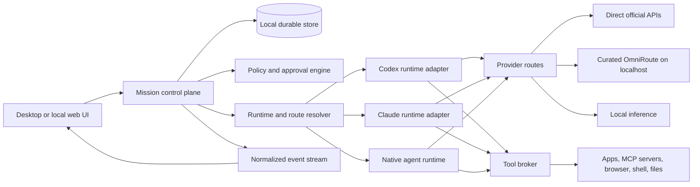

# Architecture

Status: architectural baseline for the local MVP. Implementation details may evolve, but the boundaries and safety invariants are deliberate.

## System shape



The control plane owns the product. Agent runtimes and provider routers are replaceable execution dependencies; neither Codex, Claude, nor OmniRoute owns mission state, approval policy, memory, or the audit record.

## Components

### User interface

The UI renders teammate and mission state, accepts commands, exposes model controls, streams normalized execution events, collects approvals, and displays artifacts and receipts. It must never infer safety from presentation state; authorization is enforced in the control plane and tool broker.

### Mission control plane

The control plane is the durable coordinator. It:

- creates missions and immutable run identifiers;
- compiles teammate configuration plus mission overrides;
- selects a runtime and provider route;
- persists events before presenting them as durable history;
- manages cancellation, checkpoints, resume, and fallback;
- requests approvals and records their exact scope;
- produces the final execution receipt.

### Runtime adapters

Codex and Claude are **agent runtimes**, not merely model names. Each adapter converts a common run request into the runtime's supported interface and maps runtime-specific output into normalized events.

The installed-runtime integration invokes a user's local, already-configured runtime. It must not read, copy, export, or pool the runtime's authentication files. Official SDK or documented non-interactive interfaces are preferred:

- Codex: official Codex SDK or `codex exec --json`-style structured execution.
- Claude: official Claude Agent SDK or the documented headless/streaming interface, subject to Anthropic's current product and authentication terms.
- Native runtime: a minimal first-party loop for direct APIs and local/free models when an installed coding-agent harness is inappropriate.

Every adapter implements the same conceptual contract:

```text
detect() -> runtime availability and version
capabilities(profile) -> tools, context, media, structured output, sandbox
start(runRequest) -> event stream plus control handle
cancel(runId) -> acknowledged cancellation
resume(checkpoint, route) -> event stream
health() -> readiness and actionable diagnostics
```

### Runtime and route resolver

The resolver applies global defaults, teammate configuration, and mission overrides; filters routes by capability and policy; and resolves one explicit execution route. Fallback behavior is specified in [MODEL_ROUTING.md](./MODEL_ROUTING.md).

### Tool broker

All external actions pass through a shared broker even when a runtime has its own tool protocol. The broker applies permissions, approval rules, validation, timeouts, idempotency keys, redaction, and action receipts. Runtime adapters should expose tools through the safest protocol they support rather than bypassing the broker.

### Durable local store

The MVP stores product state locally. SQLite is a sensible default for structured state, with a project-managed artifact directory for larger files. At minimum, persist:

- `TeammateProfile`
- `RuntimeProfile` and non-secret route metadata
- `Mission`, `Run`, and `Step`
- append-only `RunEvent`
- `Checkpoint`
- `ApprovalRequest` and `ApprovalDecision`
- `ToolAction` and idempotency status
- `Artifact`
- `RouteSwitchReceipt`

Secrets belong in the operating system credential store or a user-selected secret manager, referenced by opaque identifiers. They do not belong in SQLite events, logs, teammate exports, or source control.

## Normalized event model

Adapters emit a small stable vocabulary. Payloads may preserve a namespaced raw event for diagnostics.

```text
run.started
plan.updated
message.delta
step.started | step.completed | step.failed
tool.requested | tool.approval_required | tool.started | tool.completed | tool.failed
checkpoint.created
route.limit_detected | route.switch_proposed | route.switched | route.verification_failed
artifact.created
run.waiting | run.cancelled | run.failed | run.completed
```

Each event includes run ID, sequence number, timestamp, source adapter, resolved route ID, and correlation IDs for its step and tool action. Events are append-only. Corrections are new events, not rewrites.

## Safety invariants

1. A route may change only between reconciled steps, never halfway through an unresolved side effect.
2. A side-effecting tool call has a durable action record and idempotency key before dispatch.
3. Cancellation prevents new work and reconciles the status of work already dispatched.
4. Approval grants are narrow: action, target, important arguments, time/run scope, and route where relevant.
5. Authentication and safety failures do not trigger “try every provider” fallback.
6. A weaker fallback cannot inherit tools it is not verified to use safely.
7. The UI always receives the resolved route and any subsequent switch; “Auto” is a policy, not a hidden model identity.

## Checkpoint and handoff protocol

When a quota or transient provider limit occurs:

1. Stop scheduling new steps.
2. Reconcile any in-flight tool action as completed, failed, unknown, or safely retryable.
3. Persist a checkpoint containing mission state, compact context, artifacts, outstanding approvals, completed action IDs, and the next intended step.
4. Ask for or resolve a fallback route according to policy.
5. Confirm capability compatibility and reduce permissions if necessary.
6. Start the replacement runtime from the checkpoint.
7. Require a state-verification step before restoring side-effect permissions.
8. Emit a route-switch receipt showing the reason, old route, new route, changed capabilities, and verification result.

Unknown side effects are never automatically replayed. The user sees a reconciliation prompt with evidence.

## Local MVP boundary and future cloud runners

The first implementation executes on the user's computer and may stop when that computer or application stops. Do not simulate persistence by hiding background processes with unclear ownership.

Keep execution behind a `Runner` boundary from the beginning:

```text
LocalRunner.spawn(runtimeSpec, workspace, environment)
LocalRunner.signal(runId, cancel | pause | resume)
LocalRunner.stream(runId)
LocalRunner.snapshot(runId)
```

A future `CloudRunner` can implement the same semantics with isolated workspaces, encrypted secrets, leases, heartbeats, artifact transfer, and suspend/resume. Mission, event, approval, and route models should remain unchanged.

## Trust boundaries

- **Trusted product code:** control plane, policy engine, durable store, and tool broker.
- **User-authorized local runtimes:** Codex, Claude, local inference servers, and their documented SDK/CLI interfaces.
- **Potentially untrusted model providers and routers:** all prompts and tool outputs are minimized according to route privacy policy.
- **Untrusted content:** web pages, documents, tool output, teammate imports, and runtime text can contain prompt injection and never grant authority.
- **External side effects:** email, publishing, account changes, payments, and destructive filesystem operations require explicit policy classification and receipts.

## Testing strategy

- Contract tests run identical fixtures against every runtime adapter.
- Event-order and cancellation tests use deterministic fake runtimes.
- Routing tests cover every error category and ensure forbidden fallbacks never occur.
- Tool tests verify idempotency, narrow approvals, redaction, and unknown-result reconciliation.
- End-to-end fixtures exercise start, pause, approve, quota fallback, resume, cancel, and artifact delivery.
- Provider-dependent smoke tests are opt-in and never require a developer's personal session in CI.
